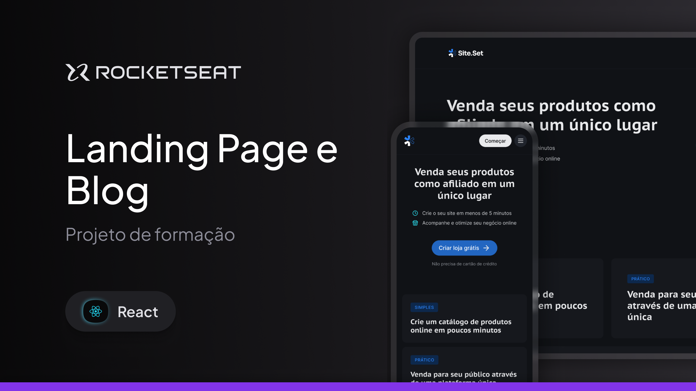
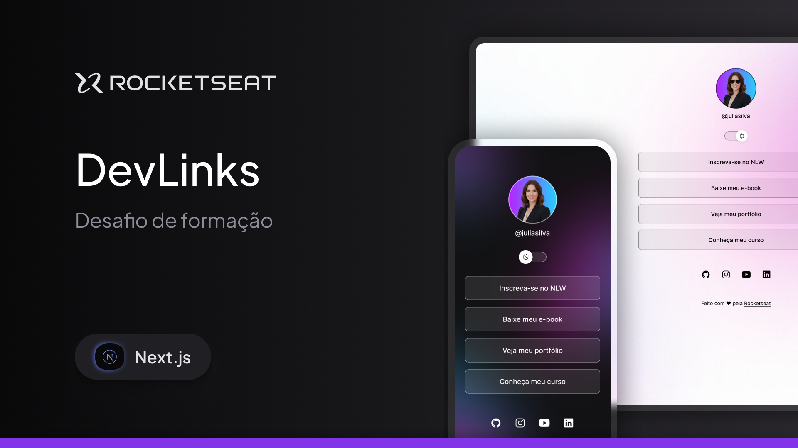
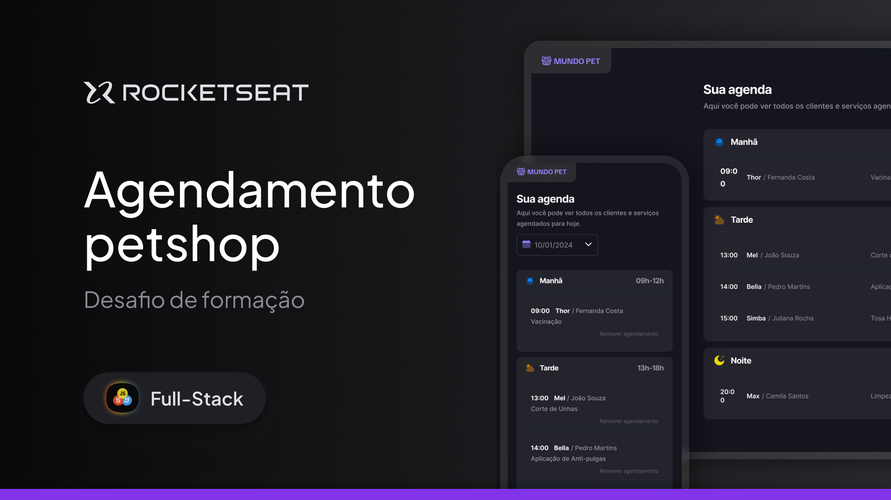

  

<h1 align="center">Formação Next.js 2025</h1>

  Repositório contendo os projetos desenvolvidos ao longo do curso de Formação Next.js da Rocketseat.

---

## Projetos

### 1. Site Blog

Um blog construído com Next.js e Contentlayer para gerenciamento de conteúdo. O projeto explora a criação de páginas estáticas a partir de arquivos Markdown, com suporte a renderização de código syntax-highlighted e diferentes temas de interface.

**Tecnologias:**
- **Framework:** Next.js 16
- **UI Library:** React 19
- **CMS:** Contentlayer2
- **Estilização:** Tailwind CSS 4
- **Componentes:** shadcn/ui
- **Linting/Format:** Biome

---

### 2. DevLinks

Uma plataforma de links estilo Linktree desenvolvida como desafio prático do módulo de fundamentos. O projeto utiliza Prismic como CMS headless para o gerenciamento dos links, com suporte a modo claro/escuro e interface responsiva.

**Tecnologias:**
- **Framework:** Next.js 16
- **UI Library:** React 19
- **CMS:** Prismic CMS
- **Estilização:** Tailwind CSS 4
- **Componentes:** shadcn/ui

---

### 3. PetShop

Um sistema de agendamento de serviços para pet shop, construído com foco em_boas práticas de desenvolvimento fullstack. O projeto inclui formulários com validação, integração com banco de dados PostgreSQL via Prisma ORM, e interface completa para gerenciamento de agendamentos.

**Tecnologias:**
- **Framework:** Next.js 16
- **UI Library:** React 19
- **Banco de Dados:** PostgreSQL + Prisma ORM
- **Formulários:** React Hook Form + Zod
- **Estilização:** Tailwind CSS 4
- **Componentes:** shadcn/ui
